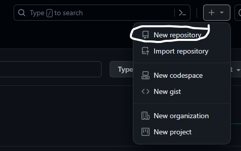
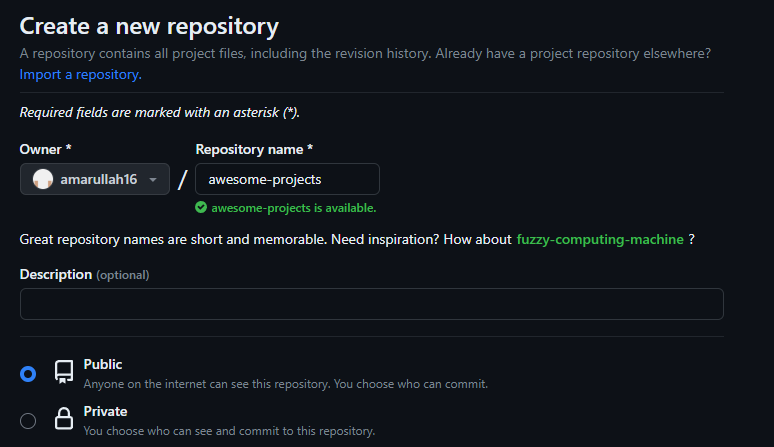
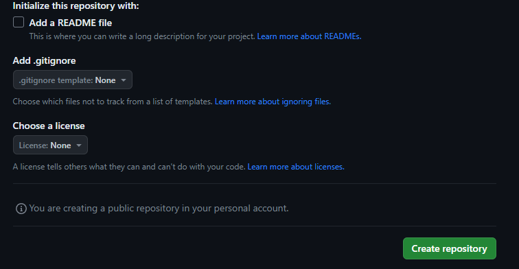

# Konfigurasi Git
Gunakan perintah berikut:
```
$ git config --global user.name "amarullah"
$ git config --global user.email "amarullahahmad16@gmail.com"
```
Untuk melihat konfigurasi yang sudah ada:
```
$ git config --list
user.email=amarullahahmad16@gmail.com
user.name=amarullah
color.ui=true
$
```

# Mengelola Repo Sendiri di Akun Sendiri

## Membuat Repo
1. Klik tanda + pada bagian atas setelah login, pilih New repo
   
2. isikan nama, keterangan, serta lisensi
    
3. click create repository, repo akan dibuat dan bisa diakses menggunakan pola ``https://github.com/username/reponame``
    

## Clone Repo
adalah proses untuk menduplikasikan remote repo di Github ke komputer lokal. untuk prosesnya, gunakan perintah berikut:
``git clone https://github.com/amarullah16/awesome-projects
Cloning into 'awesome-projects'...
remote: Enumerating objects: 3, done.
remote: Counting objects: 100% (3/3), done.
remote: Compressing objects: 100% (2/2), done.
remote: Total 3 (delta 0), reused 0 (delta 0), pack-reused 0
Unpacking objects: 100% (3/3), done.
``

## Mengelola Repository
## Mengubah isi - Push Tanpa Branching dan Merging
