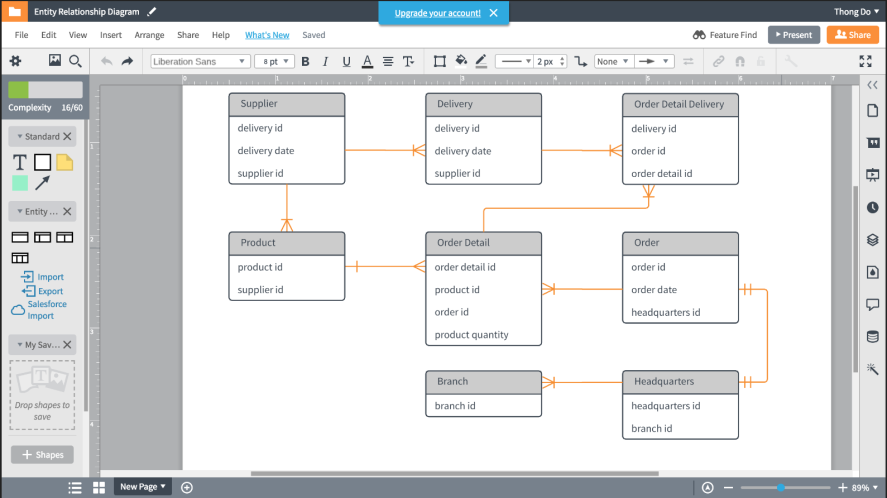
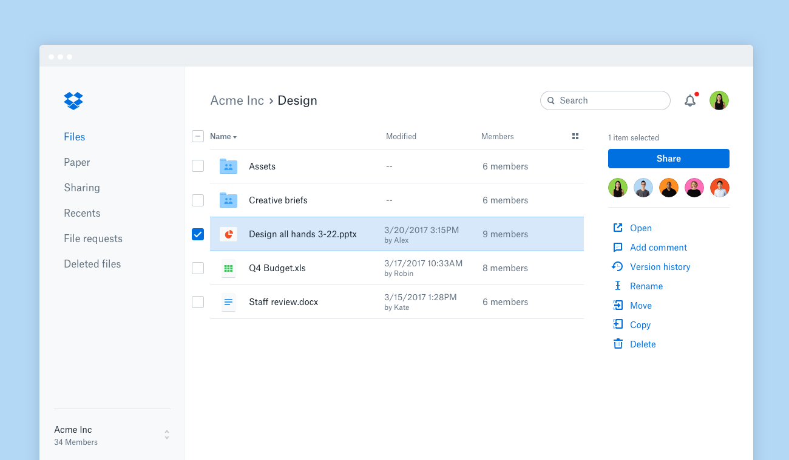
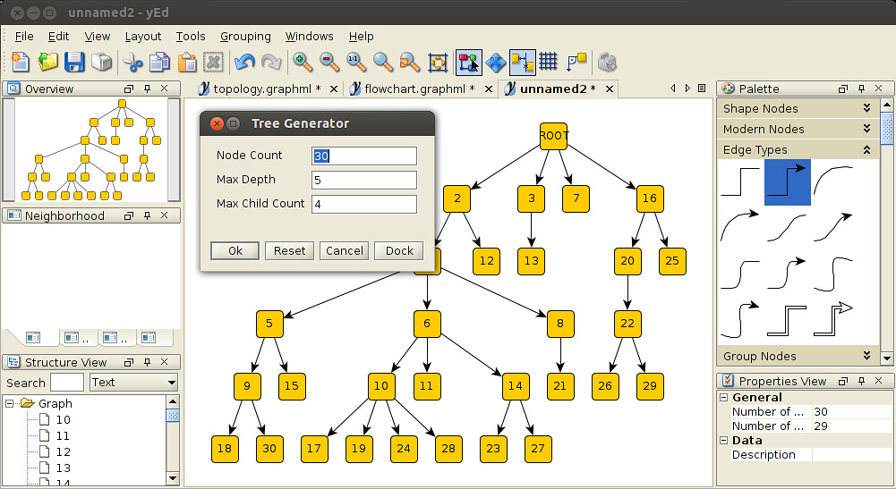

# **Overview Layanan SaaS**
---
# LucidChart

Lucidchart adalah alat `kolaborasi diagram dan visual online` yang memungkinkan pengguna untuk membuat dan berbagi berbagai jenis diagram, termasuk diagram alir, peta pikiran, bagan organisasi, dan banyak lagi. Alat ini menyediakan antarmuka yang mudah digunakan dan berbagai fitur untuk membantu pengguna memvisualisasikan dan mengomunikasikan ide mereka secara efektif.
## Fitur Utama
>**1. Di bidang IT/Engineering**
- ER diagram tool
- AWS network diagram software
- Database design tool
- Visio online
- UML diagram tool
- Network diagram software
- Workflow diagram software
- P & ID software
>**2. Di Bidang Bisnis**
- Free flowchart software & examples
- Free org chart software
- Data flow diagram software
- Process mapping software
- BPMN software
- Value stream mapping software
- Business process mapping tool
- Process documentation software
>**3. Di Bidang Produk Management & Design**
-  Wireframe software
- Android mockups
- Venn diagram maker
- Mind mapping software
- iPhone mockups
- iPad mockups
- Floor plan software
- Concept map maker
---

# DropBox

Dropbox adalah layanan penyimpanan yang cloud yang memudahkan penggunanya untuk menyimpan file secara online dan melakukan sinkronisasi ke perangkat. Dropbox dilengkapi dengan metode enkripsi yang kuat untuk menjamin data dan file kamu aman. Dropbox juga tersedia dalam bentuk aplikasi dan dapat di-download `di App Store ataupun Play Store.`

## Fungsi DropBox
>**1. Membagikan dan mengedit dokumen** : layanan Dropbox memungkinkan penggunanya untuk membagikan dokumen kepada orang lain, dari mana saja dan kapan saja. selain membagikan dokumen, layanan ini juga dapat mengedit dokumen yang sudah dibagikan, sehingga kegiatan kolaborasi akan berjalan dengan lancar.

>**2. Backup File** : Selain membagikan dan mengedit, fungsi lainnya dari Dropbox adalah dapat melakukan backup terhadap file-file penting.

## Fitur DropBox
>**1. DropBox Paper** : membuat pengguna dapat membuat dan mengedit file dengan tim dalam waktu yang sama.

>**2. Integrasi** : Dropbox dapat menunjang produktivitas kerja karyawan karena dapat disinkronkan ke perangkat dan aplikasi-aplikasi tugas. DropBox mengintegrasikan layanan ini dengan aplikasi tugas seperti `Trello, Slack, Gmail, Zapier,` dan aplikasi-aplikasi tugas lainnya.

>**3. Penyimpanan Berbasis Cloud** : Penyimpanan berbasis cloud artinya semua file disimpan dan dijaga dengan baik oleh pihak ketiga. Dengan demikian, tidak perlu lagi membeli barang seperti harddisk untuk menyimpan semua file.

>**4. Peringatan dan Pemberitahuan** : salah satu fitur keamanan yang dimiliki adalah peringatan dan pemberitahuan. Jika ada sesuatu hal yang mencurigakan, seperti peretasan file atau kebocoran data, Dropbox akan memberikan pemberitahuan terkait adanya aktivitas tersebut. User bisa menggunakan fitur ini lewat Dropbox Enterprise.
---

#yEd

Adalah aplikasi cross-platform yang berjalan pada `Windows, Linux, Mac OS, dan platform lainnya yang mendukung Java VM`. yEd dapat digunakan untuk menyusun berbagai jenis diagram, termasuk `diagram alir, diagram jaringan, UML, BPMN, peta pikiran, diagram organisasi, dan diagram hubungan entitas.`

Pada aplikasi ini, pengguna juga dapat memasukkan gambar berformat `vektor dan grafis raster sebagai elemen diagram`. yEd memuat dan menyimpan diagram berformat GraphML, sebuah format berbasis XML.

Ini juga bisa mencetak diagram berukuran sangat besar yang membentang beberapa halaman. yEd secara otomatis dapat mengatur elemen diagram, menggunakan berbagai algoritma `tata letak grafik, termasuk tata letak berbasis bobot, tata letak hirarki (untuk diagram alir), tata letak ortogonal (untuk diagram kelas UML), dan tata letak cabang pohon (untuk diagram organisasi).`
##Fitur yEd
>**1. Mengimpor data dalam berbagai format untuk menghasilkan diagram darinya** : Format impor mencakup `format Microsoft Excel .xls untuk data spreadsheet, format Gedcom untuk data silsilah, dan juga format file berbasis XML`.

>**2. Mengekspor diagram ke berbagai format raster dan vektor** : termasuk GIF, JPEG, PNG, EMF, BMP, PDF, EPS, dan SVG. yEd ini juga dapat mengekspor ke format file SWF (Shockwave Flash) dan peta gambar HTML. Informasi struktural suatu diagram dapat diekspor sebagai GML (Graph Modeling Language) dan TGF (Trivial Graph Format).
---

# Gliffy

Gliffy adalah perangkat lunak untuk membuat diagram melalui aplikasi `berbasis cloud HTML5` . Ini digunakan untuk membuat `diagram UML , denah lantai, diagram Venn , diagram alur` , dan berbagai jenis diagram lainnya secara online. Diagram Gliffy dapat dibagikan dan diedit oleh pengguna secara real time. SaaS didukung di semua browser web modern , termasuk `Google Chrome, Firefox, Safari, dan Internet Explorer 9+`.

Pada awal 2013, Gliffy pindah ke semua platform HTML5, pada saat yang sama menambahkan dukungan Visio. Gliffy terintegrasi dengan `Google Apps , Google Drive , JIRA , dan Confluence` , dan memiliki lebih dari dua juta pengguna terdaftar.

Gliffy menampilkan antarmuka `drag-and-drop` dan kolaborasi online real-time dan kemampuan berbagi. Ini memungkinkan pengguna untuk mengekspor diagram mereka dalam berbagai format termasuk: `PDF , JPEG , PNG dan SVG . Ini didukung di semua browser web modern, termasuk Google Chrome , Firefox , Safari , dan Internet Explorer 9+`.