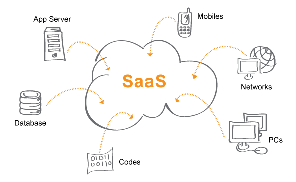

# **Perbedaan antara ``IaaS, SaaS, and PaaS``**

### Berdasarkan Definisi
>1. ``IaaS`` adalah kepanjangan dari infrastructure as a service yang mampu mengakses sekaligus memantau kinerja komputer dan platform penyimpanan.

>2. ``PaaS`` atau biasa disebut dengan platform as a service merupakan sistem yang menyediakan kerangka kerja sesuai dengan program suatu aplikasi.

>3. ``SaaS`` disebut juga software as a service yang disebut-sebut memiliki fungsi seperti Paas. 

### Karakteristik yang Dimiliki
>1. ``IaaS`` menyediakan opsi layanan yang sumber dayanya digunakan sebagai penyusun suatu hardware. Perlu diketahui, harganya dihitung dari jumlah konsumsinya.

>2. ``PaaS`` merupakan sebuah rangkaian layanan yang akan membantu melakukan pengujian, development, serta penerapan aplikasi.

>3. ``Program SaaS`` hanya bisa digunakan dengan berlangganan yang nominalnya tergantung jangka waktu penggunaannya. 

Fakta menariknya, dengan berlangganan SaaS maka seseorang tidak perlu membeli IaaS dan PaaS. 

Penyebabnya karena ketiga hal tersebut tersedia dalam satu paket. Layanannya saling berkaitan dan memberikan dampak baik pada suatu platform. 

Selama jangka waktu sewa, seluruh layanannya bisa diakses. Namun setelah itu maka harus memperpanjang masa sewanya jika ingin tetap menggunakannya. Berdasarkan ulasan mengenai perbedaan ``IaaS, PaaS, dan SaaS`` yang sudah dibahas, mengerti masing-masingnya diperlukan supaya tidak sampai salah saat menggunakannya.

---

# **SaaS Platform Architecture**
``Arsitektur SaaS`` didesain untuk memberikan pengalaman pengguna yang mudah dan memastikan ketersediaan, skalabilitas, dan keamanan layanan. Dengan menggunakan teknologi cloud dan konsep-konsep seperti ``multi-tenancy``, SaaS dapat memberikan manfaat seperti fleksibilitas, efisiensi operasional, dan biaya yang dapat diprediksi kepada pengguna akhir.

Berikut adalah beberapa komponen utama dalam ``arsitektur platform SaaS`` :
>1. ``Aplikasi SaaS``: Merupakan inti dari layanan SaaS, aplikasi tersebut menyediakan fungsionalitas bisnis atau layanan tertentu kepada pengguna akhir.

>2. ``Akses Melalu Web Browser`` : Pengguna mengakses aplikasi SaaS melalui web browser mereka tanpa perlu menginstal perangkat lunak secara lokal.

>3. ``Multi-Tenancy`` : di mana satu instance aplikasi dapat mendukung banyak pelanggan (tenants). Data dan konfigurasi untuk setiap tenant diisolasi secara aman.

>4. ``Infrastruktur Cloud`` : SaaS sering diimplementasikan di atas infrastruktur cloud seperti AWS, Azure, atau Google Cloud. Ini memungkinkan skalabilitas yang mudah dan aksesibilitas global.

>5. ``Database`` : Basis data cloud digunakan untuk menyimpan dan mengelola data pelanggan. Dalam model multi-tenancy, skema database diatur untuk memisahkan data antar tenant.

>6. ``Security`` : Ini melibatkan enkripsi data, otentikasi pengguna, kontrol akses, dan tindakan keamanan lainnya untuk melindungi data pelanggan.

>7. ``API (Application Programming Interface)`` : SaaS menyediakan antarmuka pemrograman aplikasi yang memungkinkan integrasi dengan aplikasi lain atau layanan pihak ketiga. Ini memungkinkan pelanggan untuk menghubungkan aplikasi SaaS dengan solusi internal atau eksternal.

>8. ``Monitoring & Logging`` : Sistem SaaS dilengkapi dengan mekanisme pemantauan dan logging untuk melacak kinerja aplikasi, mendeteksi masalah, dan menyediakan analisis yang berguna.

>9. ``Update dan Pemeliharaan`` : Arsitektur SaaS memungkinkan penyedia untuk melakukan pembaruan perangkat lunak secara terpusat tanpa memerlukan intervensi pengguna.
>10. ``Billing dan Manajemen Pelanggan`` : SaaS mencakup sistem pengelolaan pelanggan dan penagihan untuk mengelola langganan dan mendukung model bisnis berbasis langganan.

---

# **SaaS (Software As A Service) Platform Architecture**

Adalah sebuah metode pengiriman perangkat lunak di mana vendor menghosting aplikasi di server jarak jauh untuk organisasi sebelum mengirimkan kemampuan aplikasi tersebut ke pengguna akhir organisasi tersebut melalui Internet.

Arsitektur ini memungkinkan beberapa perusahaan atau organisasi untuk berbagi satu model dan satu konfigurasi. Ini berarti bahwa organisasi-organisasi ini mengakses aplikasi yang dihosting yang sama, termasuk perangkat keras, sistem operasi, jaringan, dan komponen lainnya yang sama.

Arsitektur SaaS memiliki beberapa keutungan, diantaranya :
>1. ``Skalabilitas`` : Arsitektur SaaS dapat dengan mudah diskalakan untuk mengakomodasi lebih banyak pengguna atau data. Ini karena vendor SaaS dapat menambahkan atau menghapus sumber daya server sesuai kebutuhan.

>2. ``Keandalan`` : Arsitektur SaaS biasanya sangat andal karena vendor SaaS memiliki tim ahli yang memantau dan mengelola infrastruktur mereka.

>3. ``Keamanan`` : Arsitektur SaaS juga biasanya sangat aman karena vendor SaaS menerapkan langkah-langkah keamanan yang kuat untuk melindungi data pelanggan.

>4. ``Biaya yang lebih rendah`` : Arsitektur SaaS dapat membantu organisasi menghemat uang karena tidak perlu membeli dan memelihara perangkat lunak mereka sendiri.

Dan beberapa contoh ``Arsitektur SaaS`` yaitu :
>1. ``Aplikasi produktivitas kantor`` : Aplikasi produktivitas kantor seperti Microsoft Office 365 dan Google Workspace adalah contoh arsitektur SaaS. Aplikasi ini dapat diakses oleh pengguna melalui web browser atau aplikasi seluler.

>2. ``Aplikasi CRM (Customer Relationship Management)`` : Aplikasi CRM seperti Salesforce dan HubSpot adalah contoh arsitektur SaaS. Aplikasi ini membantu organisasi untuk mengelola hubungan mereka dengan pelanggan.

>3. ``Aplikasi ERP (Enterprise Resource Planning)`` : Aplikasi ERP seperti SAP dan Oracle ERP Cloud adalah contoh arsitektur SaaS. Aplikasi ini membantu organisasi untuk mengelola proses bisnis inti mereka, seperti keuangan, manufaktur, dan penjualan.
---
# **How to build a cloud-based SaaS Application**
Pengembangan ``perangkat lunak SaaS`` memiliki keunikan tersendiri karena sifat aplikasi SaaS yang berbasis cloud, tahap-tahap yang diperlukan dalam pengembangan ``perangkat lunak SaaS`` diantaranya : 
>1. ``Tentukan tujuan dan target pengguna aplikasi Anda:`` Sebelum masuk ke aspek teknis, penting untuk memiliki pemahaman yang jelas tentang masalah apa yang ingin dipecahkan oleh aplikasi dan siapa yang akan mendapatkan manfaat darinya. Hal ini akan membentuk proses pengembangan Anda dan membantu memprioritaskan fitur.

>2. ``Pilih Platform Cloud:`` Memilih platform cloud yang tepat sangat penting untuk membangun aplikasi SaaS berbasis cloud. Pilihan populer termasuk `Amazon Web Services (AWS), Microsoft Azure, dan Google Cloud Platform.` Pertimbangkan faktor-faktor seperti harga, skalabilitas, keamanan, dan ketersediaan layanan yang dibutuhkan.

>3. ``Rancang Arsitektur Aplikasi  :`` Rencanakan bagaimana aplikasi akan terstruktur dan bagaimana komponen-komponennya akan berinteraksi satu sama lain. Ini termasuk merancang skema basis data, mendefinisikan API, dan menentukan kerangka kerja frontend. Pertimbangkan juga untuk menggunakan arsitektur layanan mikro untuk skalabilitas dan fleksibilitas.

>4. ``Kembangkan Backend :`` Mulailah dengan membangun logika backend aplikasi yang akan dibuat. Hal ini melibatkan penerapan logika bisnis, membuat API, mengelola otentikasi dan otorisasi pengguna, dan mengintegrasikan dengan layanan eksternal. Pilih bahasa pemrograman dan kerangka kerja yang sesuai dengan kebutuhan proyek.

>5. ``Bangun Bagian Fronted :`` Kembangkan antarmuka pengguna (UI) aplikasi Anda menggunakan teknologi web seperti `HTML, CSS, dan JavaScript.` Pertimbangkan untuk menggunakan kerangka kerja frontend seperti `React, Angular, atau Vue.js` untuk meningkatkan efisiensi pengembangan dan memberikan pengalaman pengguna yang lebih baik.

>6. ``Menerapkan Penyimpanan dan Manajemen Data :`` Tentukan jenis basis data yang akan digunakan untuk menyimpan data aplikasi. Pilihannya meliputi database relasional seperti `MySQL atau PostgreSQL, database NoSQL seperti MongoDB atau Cassandra`, atau solusi penyimpanan berbasis awan seperti `Amazon S3 atau Azure Blob Storage.`

>7. ``Memastikan Skalabilitas dan Kinerja:`` Sebagai aplikasi berbasis cloud, skalabilitas dan kinerja sangat penting. Manfaatkan layanan cloud seperti penyeimbang beban, penskalaan otomatis, dan caching untuk menangani permintaan pengguna yang meningkat. Optimalkan kode dan kueri basis data untuk memastikan kinerja yang efisien.

>8. ``Terapkan Langkah-langkah Keamanan:`` eamanan harus menjadi prioritas utama saat membangun aplikasi SaaS. Terapkan langkah-langkah seperti enkripsi, autentikasi pengguna yang aman, dan kontrol akses berbasis peran untuk melindungi data pengguna. Perbarui dan tambal aplikasi Anda secara teratur untuk mengatasi kerentanan keamanan.

>9. ``Uji Secara Menyeluruh:`` Lakukan pengujian menyeluruh untuk memastikan aplikasi Anda berfungsi dengan benar dan bebas dari bug. Uji berbagai skenario, termasuk kasus-kasus khusus, untuk memvalidasi stabilitas dan keandalan aplikasi Anda.

>10. ``Menerapkan dan Evaluasi:`` Menerapkan aplikasi Anda ke platform cloud pilihan Anda. Siapkan alat pemantauan untuk melacak kinerja, mendeteksi masalah, dan mengumpulkan wawasan tentang perilaku pengguna. Pantau dan optimalkan aplikasi Anda secara terus-menerus untuk memastikan ketersediaan dan kinerjanya.
