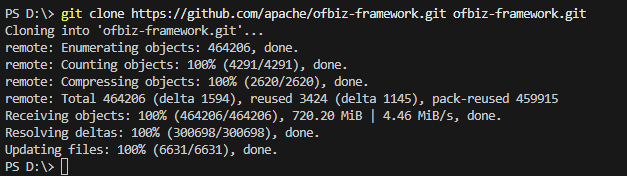
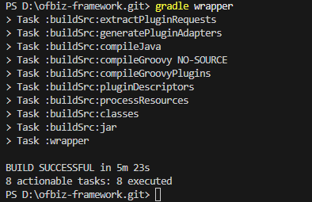
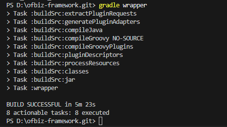
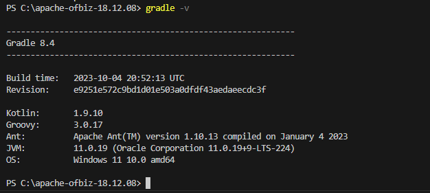
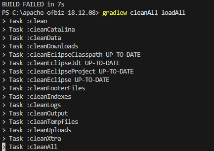
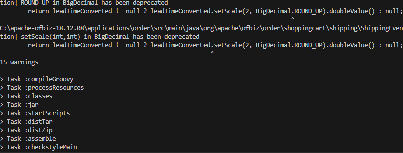
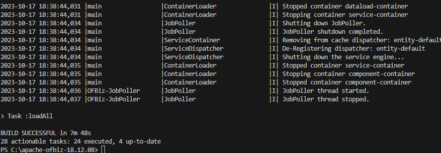
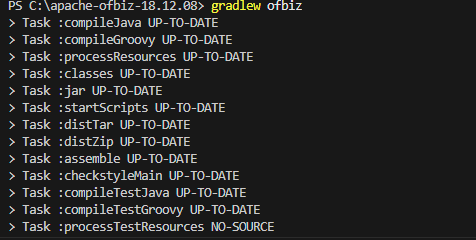
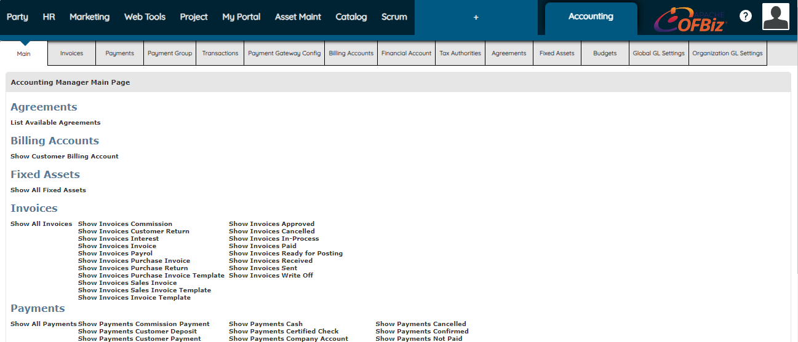

# Instalasi Apache OfBiz
## Instalasi Gradle untuk Apache Ofbiz
>1. **Mengunduh Apache Apache OfBize melalui `clone github`**

>2. **Instalasi Gradle**

>3. **Gradle sudah terinstal**

>4. **Memulai Instalasi Apache OfBiz**

>5. **Ketikkan Perintah `gradlew ofbiz`**

>6. **Masuk ke Halaman Apache Ofbiz**

Ketikkan username "admin" dan password "ofbiz" untuk login ke halaman utama Apache Ofbiz
>7. **Login berhasil dan sudah masuk ke halaman utama OfBiz**

