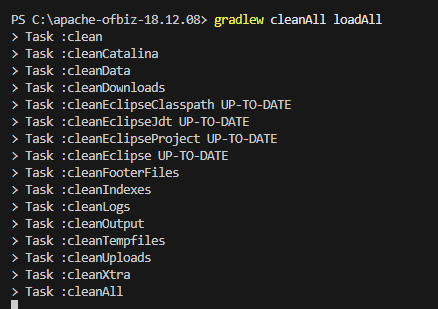
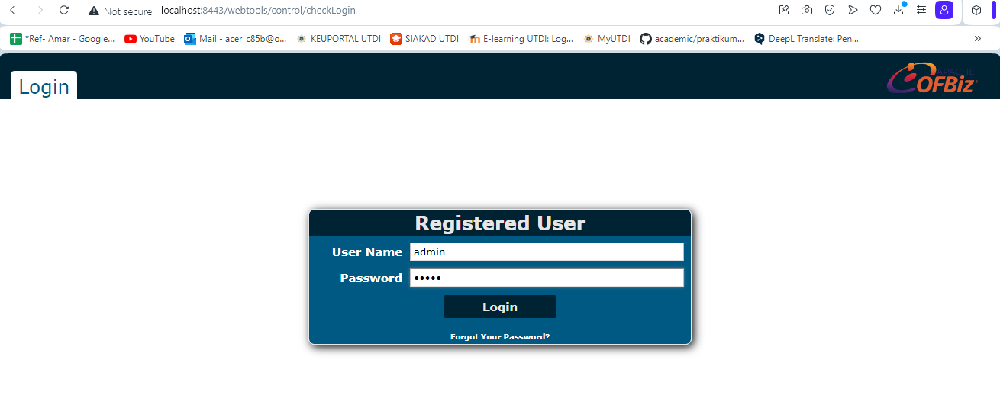
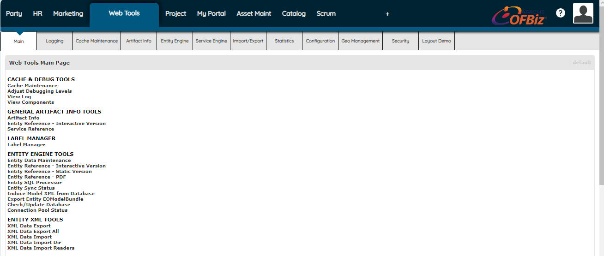

# Instalasi Apache OfBiz
>1. **Install Gradle**

>2. **Instalasi Apache OfBiz**

>3. **Memulai Apache OfBiz**
Masuk ke `https://localhost:8443/webtools` dan ketikkan username "admin" password "ofbiz"

Instalasi sudah berhasil dan sekarang masuk ke halaman utama Apache Ofbiz

