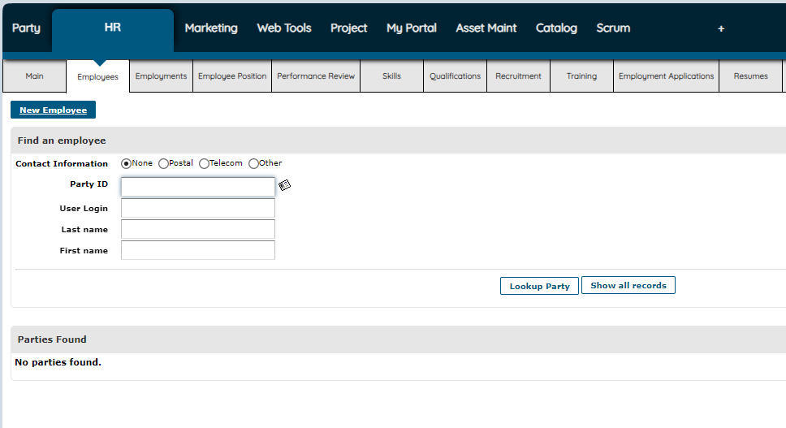
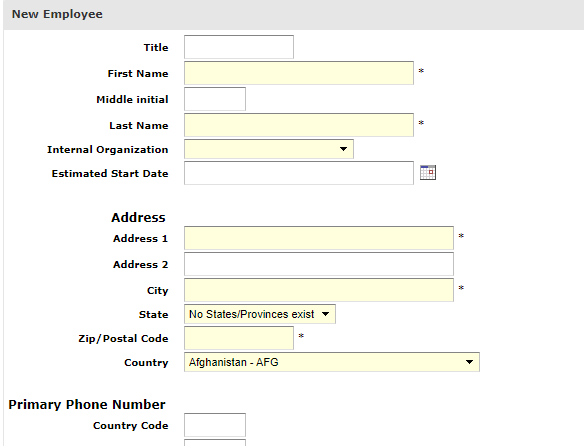
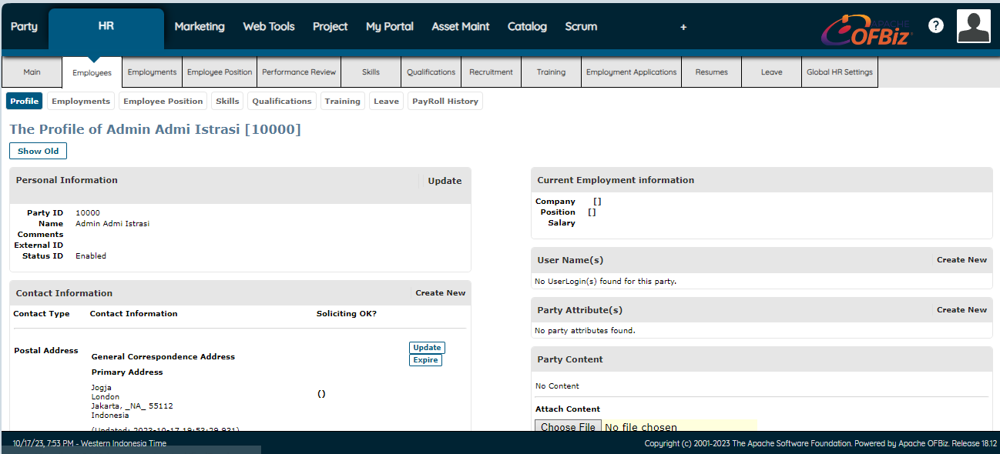

# Contoh Panduan Penggunaan Fitur "HR" di Apache Ofbiz

>1. **Masuk Ke Bagian HR, kemudian pilih Employees**

>2. **Pilih `New Employees` Isikan pada kolom yang tersedia**

>3. **Data Pribadi Karyawan Baru Sudah Ditambahkan**
