# 1. 2 Contoh Program Go Masing-masing Untuk Koneksi dan Membaca Data dari MySQL dan MongoDB
>**A. Program Go untuk koneksi  dan membaca data dari MySQL**
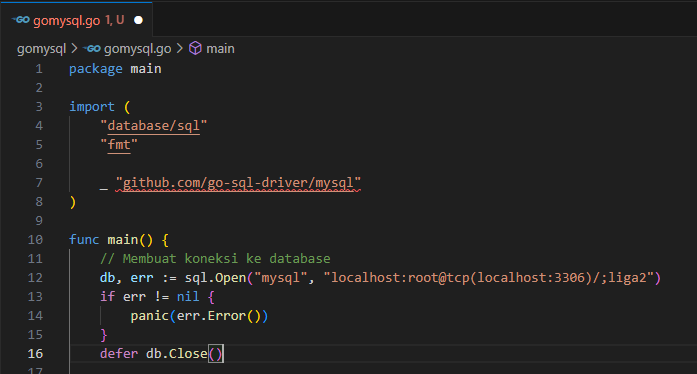
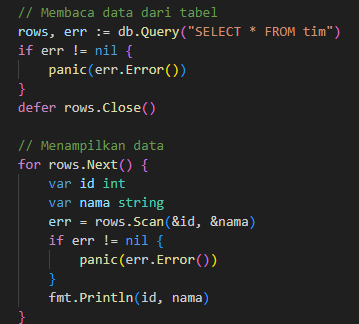
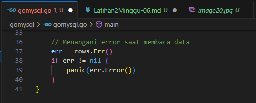

>**B. Program Go untuk koneksi dan membaca data dari MongoDB**
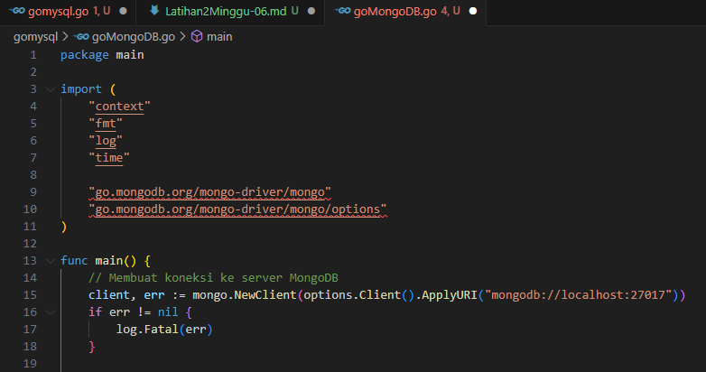
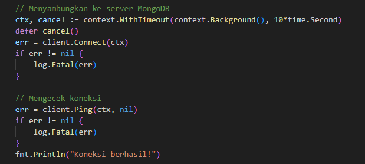
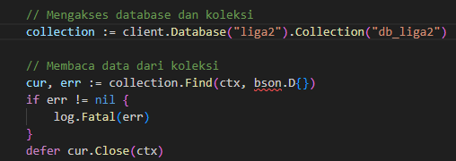
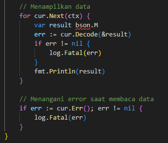

# 2. RESTful API untuk membaca data dari MySQL dan MongoDB tersebut dari Framework Gin
>**A. Lakukan import modul yang diperlukan di file Go:**
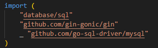

>**B. Buat koneksi ke database MySQL**
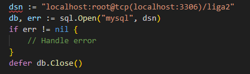

>**C. Buat endpoint RESTful API untuk membaca data, misalnya dalam hal ini membaca semua data dari tabel `klasemen`**
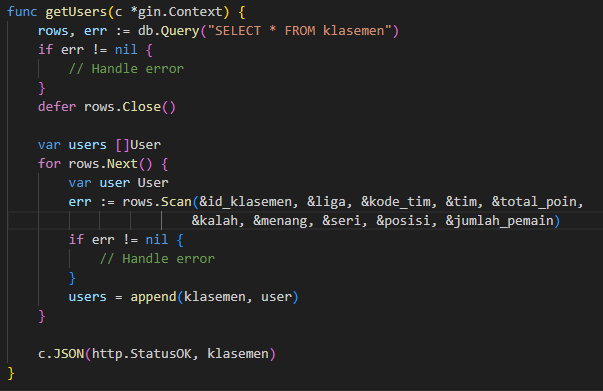

>**D. Tambahkan endpoint yang telah dibuat ke router Gin Framework**
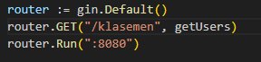

