# 1. Instalasi Go, MySQL, dan MongoDB
- ## Instalasi Go
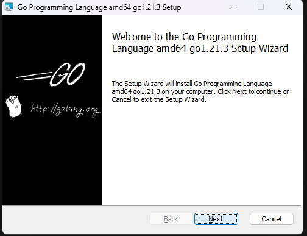
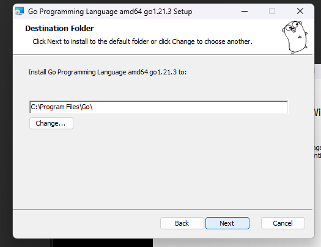
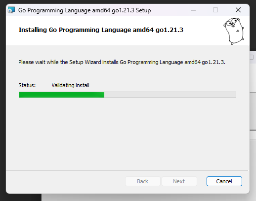
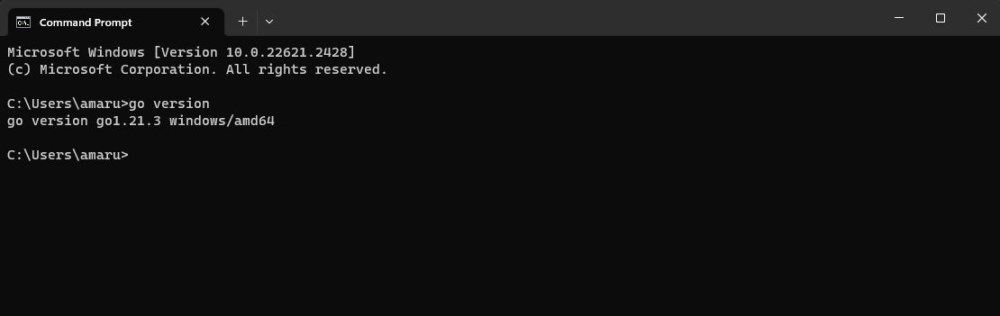

- ## Instalasi MySQL
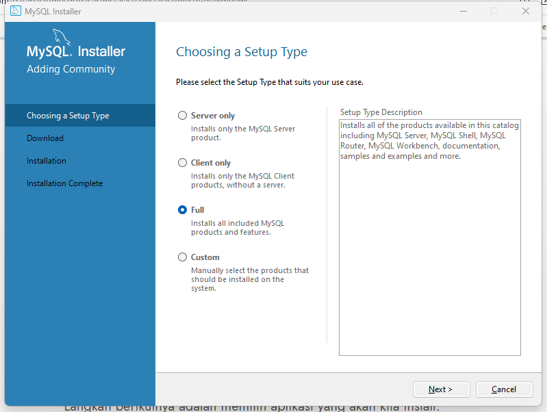
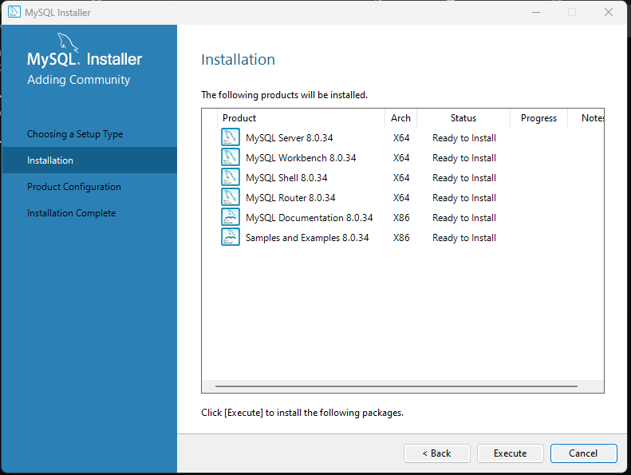
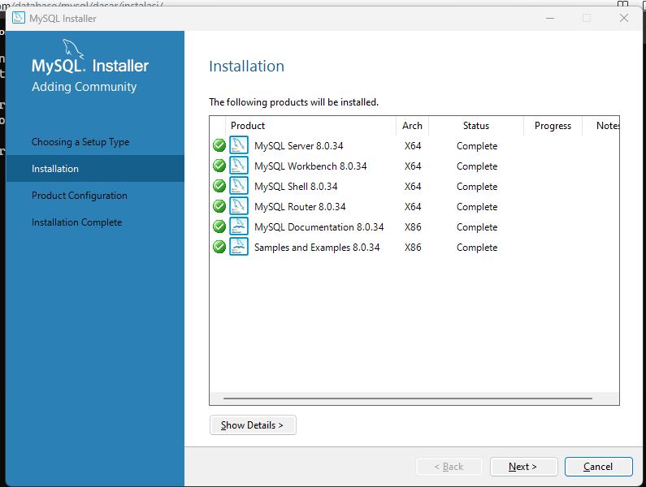
>**A. Konfigurasi Server**
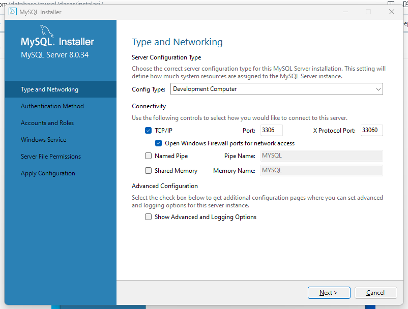

>**B. Konfigurasi Root User**
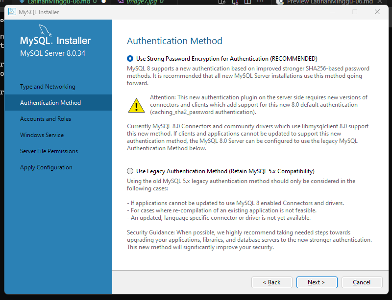
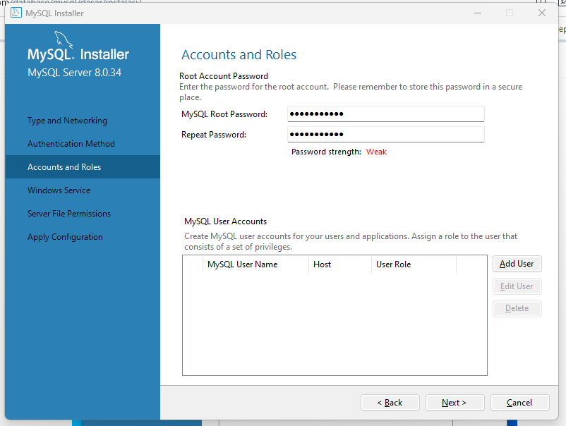

>**C. Konfigurasi MySQL Windows Service**
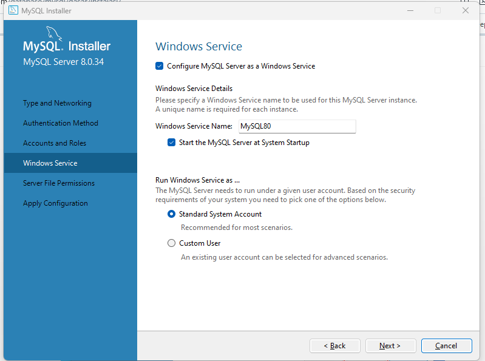
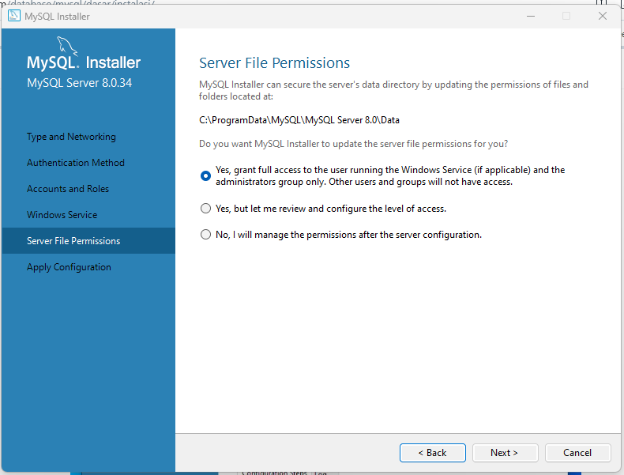
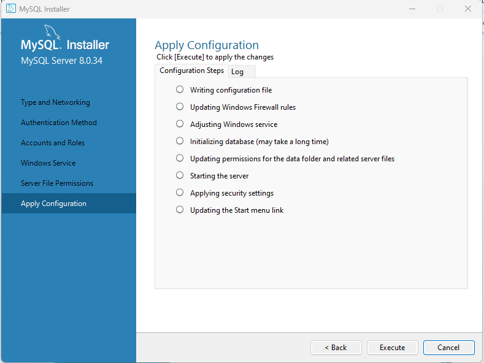
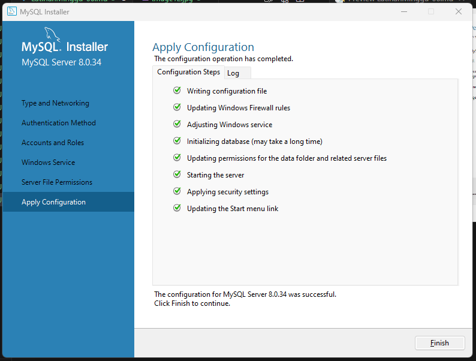

>**D. MySQL siap digunakan**
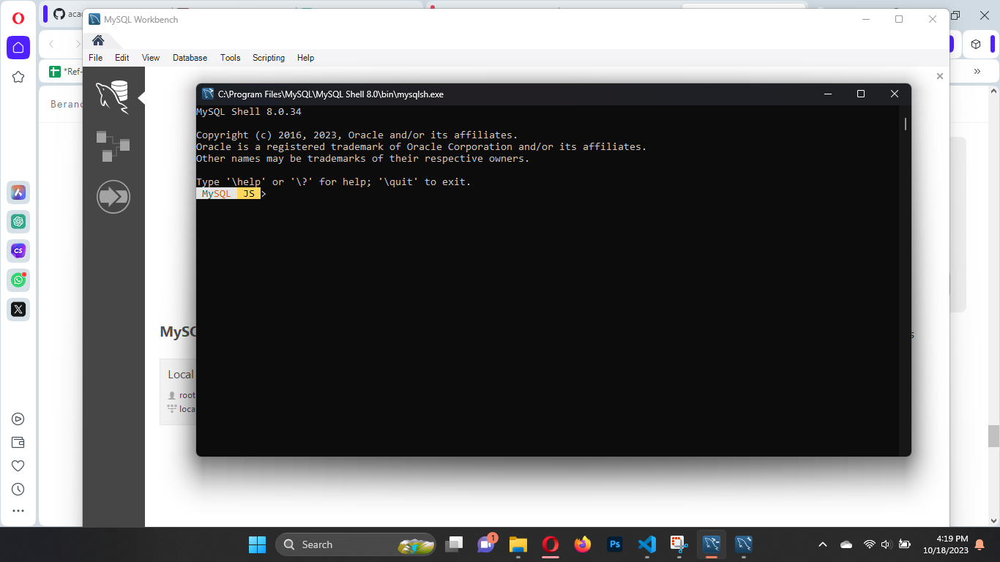

- ## Instalasi MongoDB
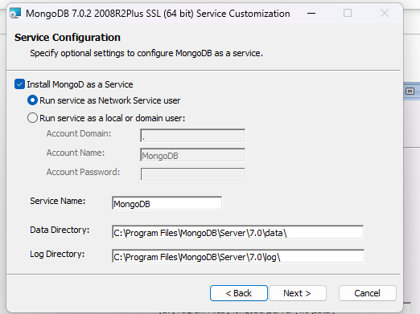

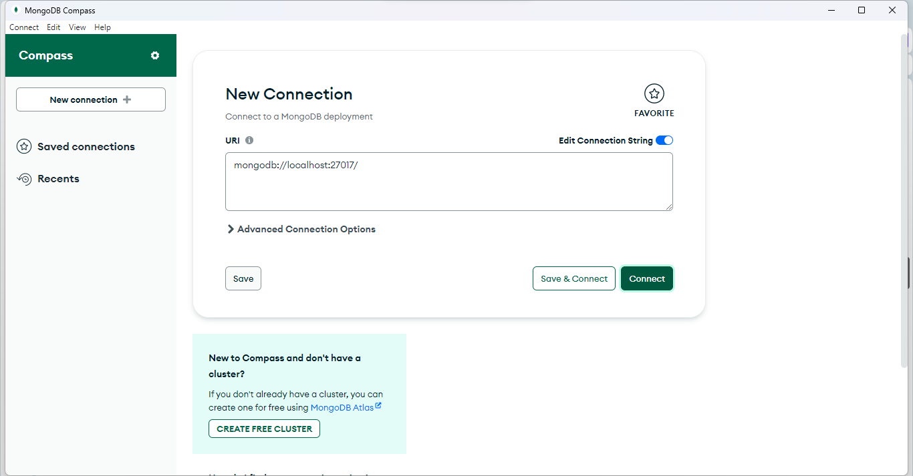
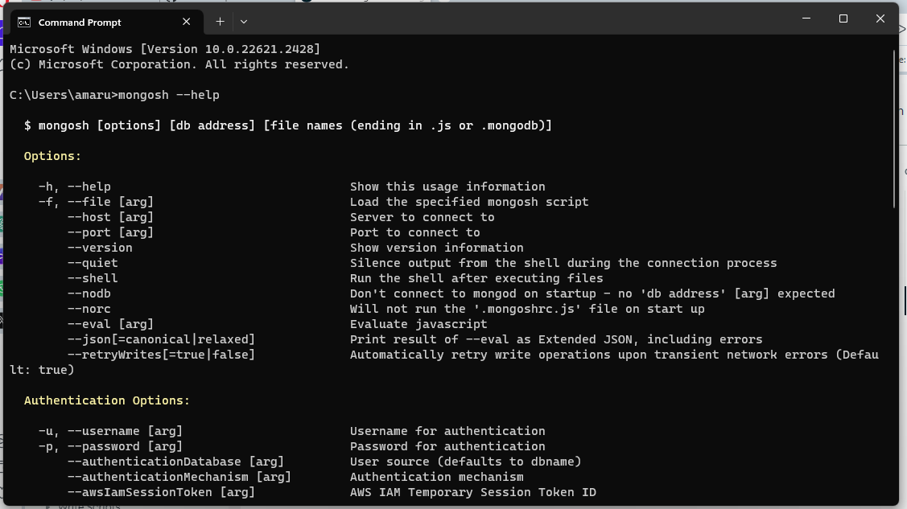