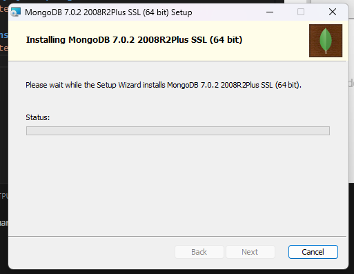

# 1. Instalasi Go, MySQL, dan MongoDB
- ## Instalasi Go

- ## Instalasi MySQL

>**A. Konfigurasi Server**

>**B. Konfigurasi Root User**

>**C. Konfigurasi MySQL Windows Service**

>**D. MySQL siap digunakan**

- ## Instalasi MongoDB

