# Instalasi Docker
>**1. Double pada aplikasi docker yang akan diinstal, maka proses instalasi Docker akan otomatis dimulai**
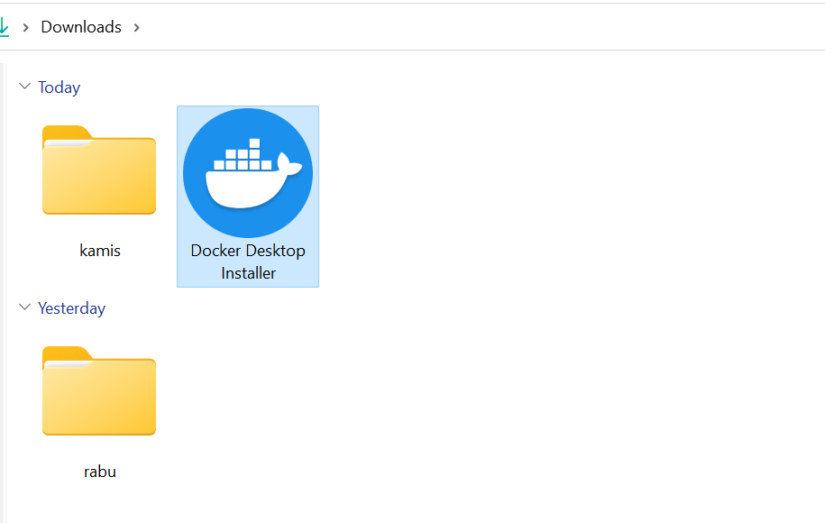

>**2. Aplikasi akan meminta untuk merestart OS untuk menyelesaikan proses instalasi**
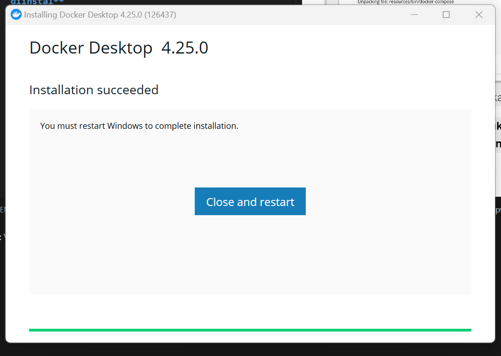

>**3. Setelah restart selesai, anda diminta untuk menyelesaikan instalasi dan memilih opsi yang tersedia. Setelah itu klik `finish`**
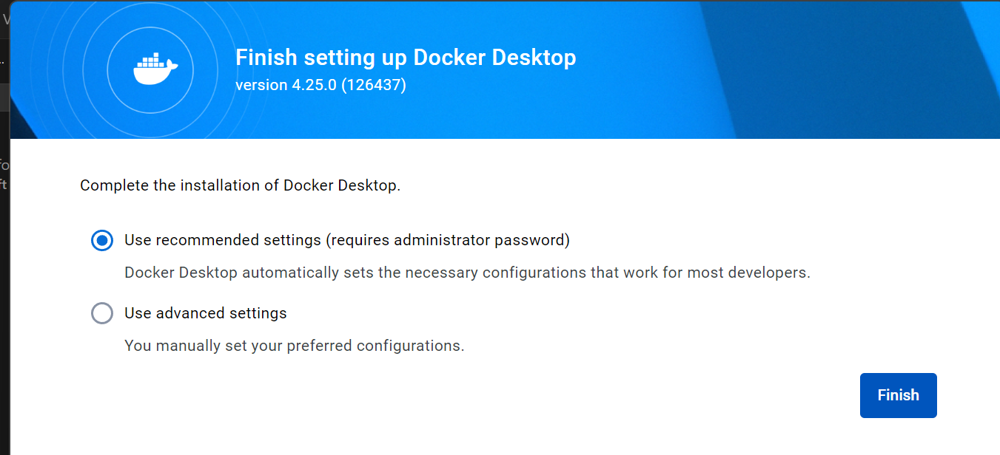

>**4. terdapat dua opsi saat membuka tampilan awal pada Docker, apakah akan login atau tanpa login. Jika belum memiliki akun bisa menggunakan opsi `sign up`**

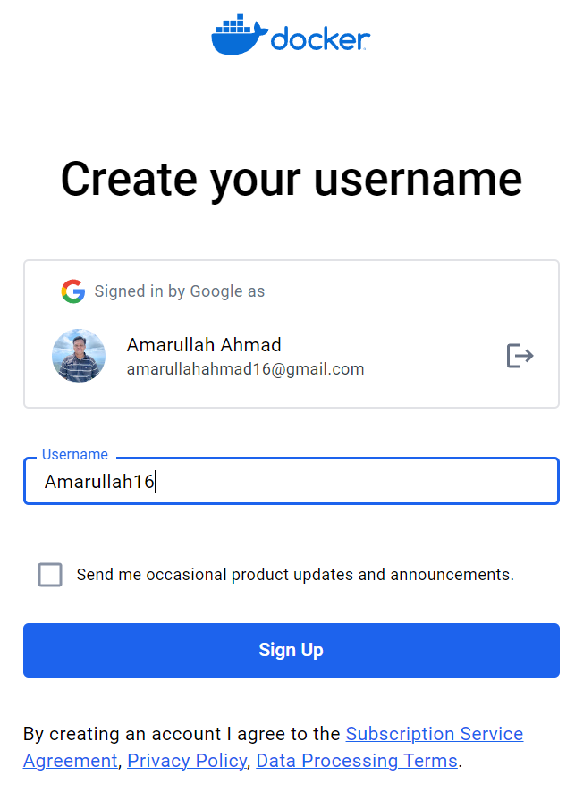

>**5. Setelah selesai sign up/login, maka akan muncul pilihan seperti di bawah ini**
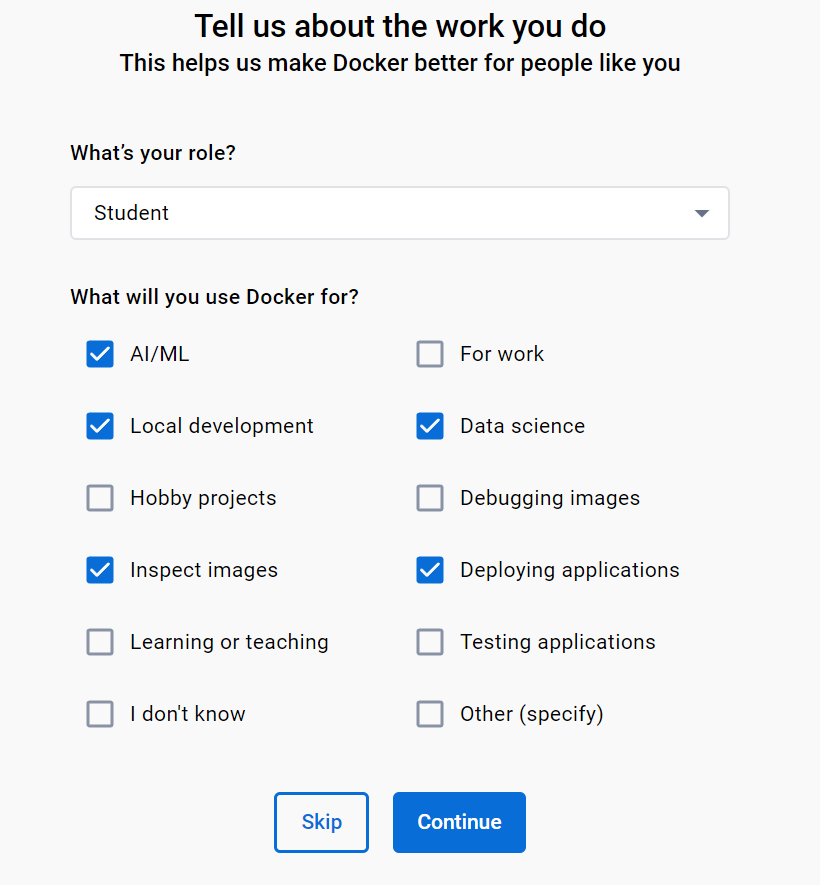

>**6. Setelah selesai melengkapi checkbox yang tadi tersedia, maka tampilan utama Docker akan muncul, dan sudah bisa digunakan**
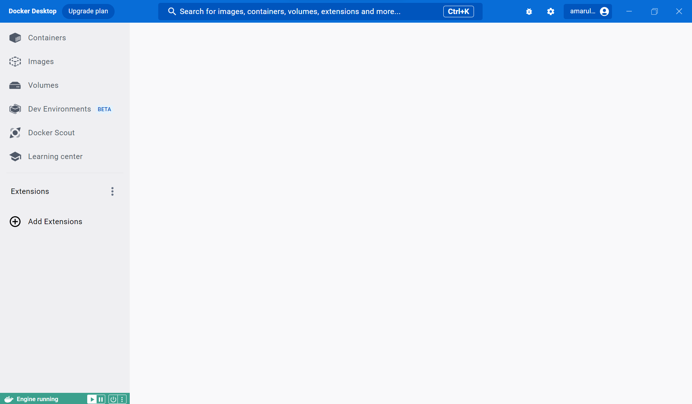
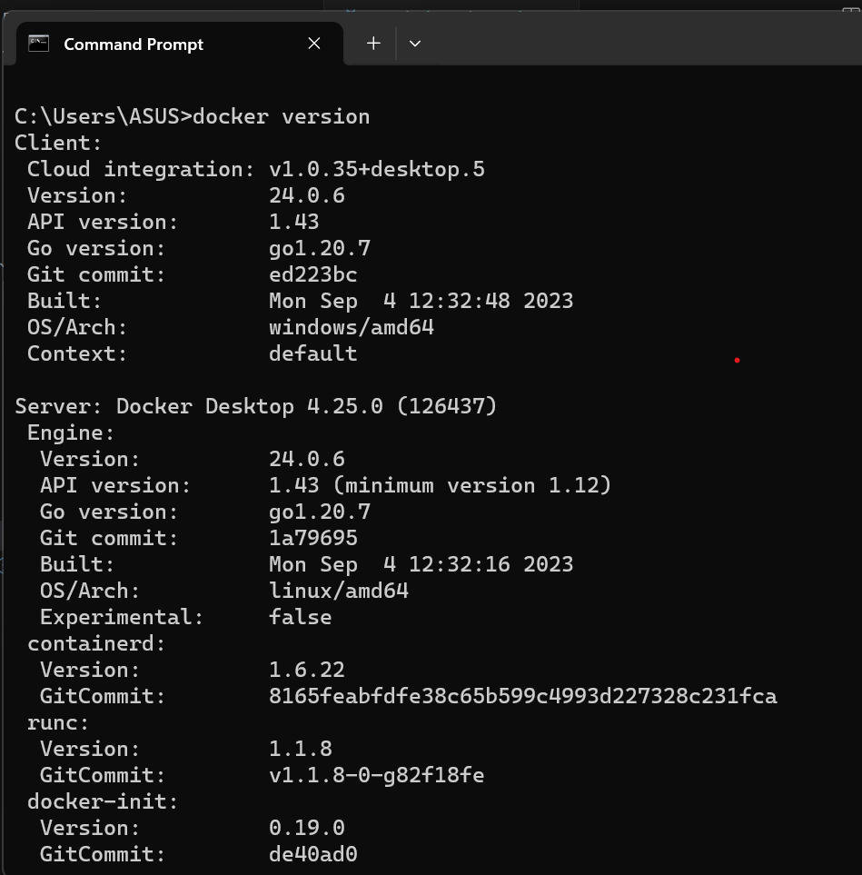

# Get Started - Docker
>**1. Get the app**
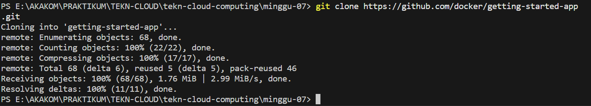

>**2. Memastikan isi dari `getting-started-app` yang sudah di clone dari github**
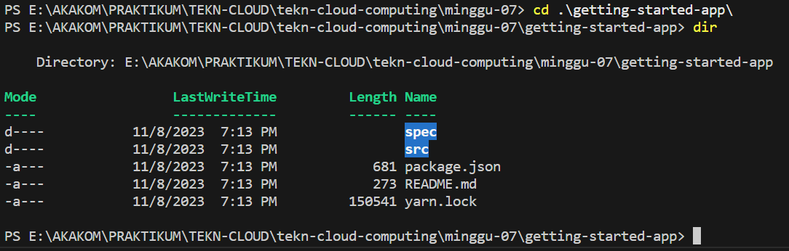

# Membuat App's Image

>**1. Unduh/clone folder `getting-started-app` dari github**
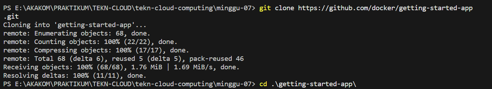

>**2. Buat file dengan nama `Dockerfile` di dalam folder `getting-started-app`**
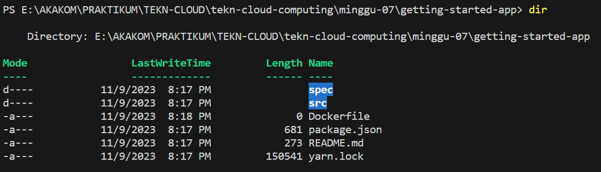

>**3. Isikan beberapa kode ke dalam file `Dockerfile` yang tadi sudah dibuat**
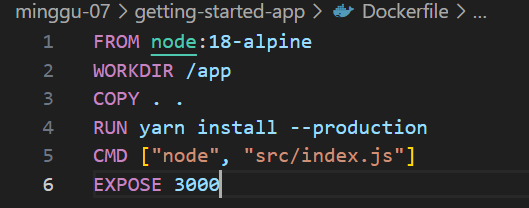

>**4. Buat image dengan memasukkan perintah berikut dan tunggu prosesnya hingga selesai**
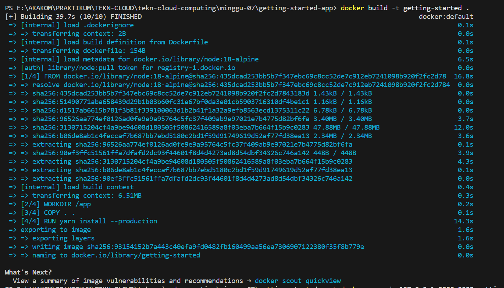

>**5. Setelah proses membuat image selesai, maka selanjutnya adalah memulai app container dengan melakukan perintah berikut ini**
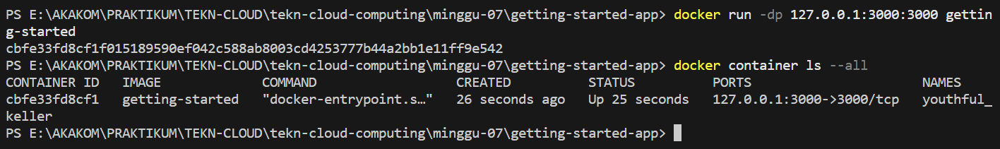
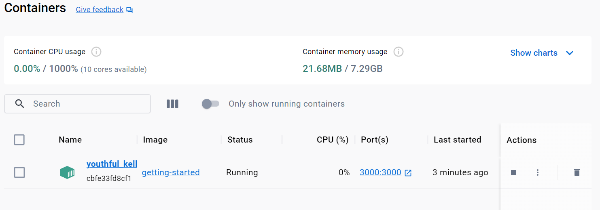

>**6. Setelah berhasil, mencoba membuka alamat `http://127.0.0.1:3000` untuk melihat hasilnya**
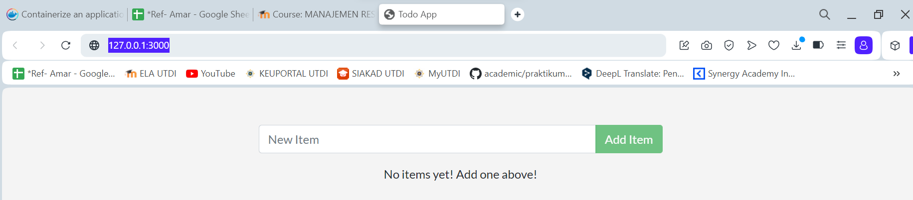

>**7. Coba menambahkan beberapa item**
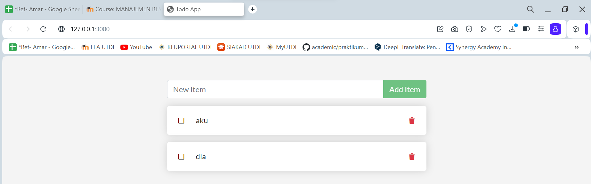