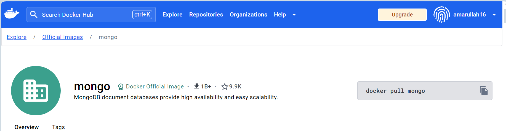
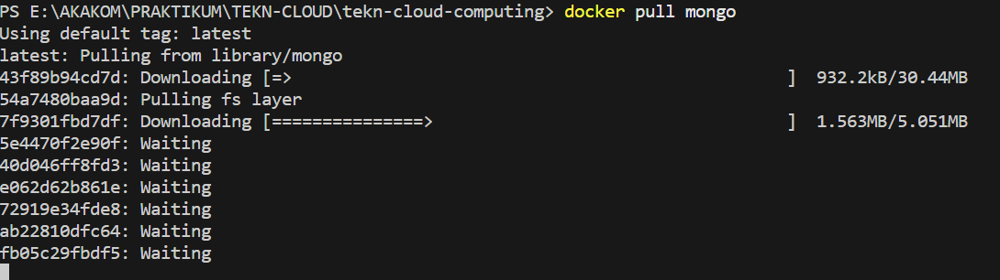
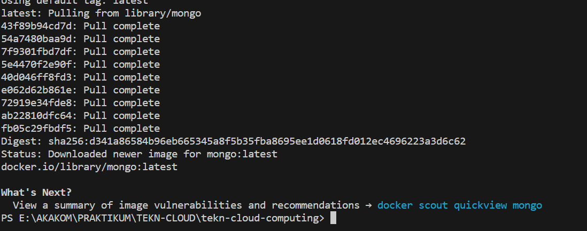
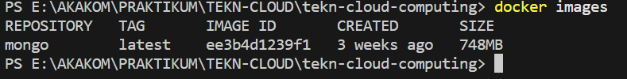
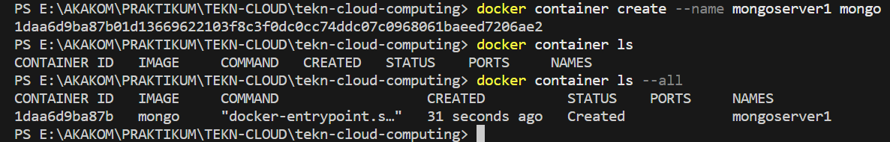
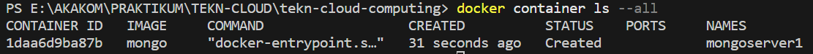
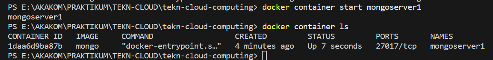
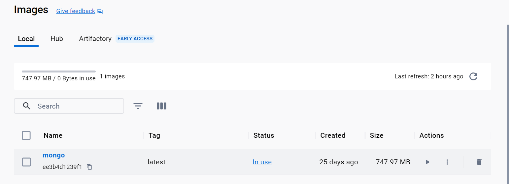
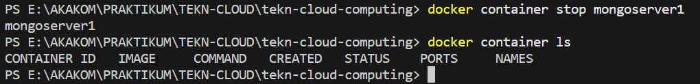

# Mengambil Image dari Docker Hub dan Menjankan di Docker

>**1. Mengunduh image yang diperlukan melalui [Hub Docker](https://www.https://hub.docker.com). Dalam kasus ini menggunakan image dari aplikasi MongoDB.**

>**2. Untuk melakukan pengunduhan, menggunakan perintah `docker pull (aplikasi yang dipilih)`**

>**3. Setelah selesai, maka hasil download akan muncul, dan untuk melihat hasilnya bisa menggunakan perintah `docker images`**

# Membuat dan menjalankan container pertama pada Docker

>**1. Membuat container pertama pada docker, dengan menggunakan perintah `docker container create --name (nama container) (image)`**

>**2. Melihat daftar container yang sudah dibuat sebelumnya**

>**3. Menjalankan container yang sudah dibuat sebelumnya, menggunakan perintah `docker container start (nama container)`**

>**4. Menghapus Container, pastikan sudah stop container yang sedang berjalan. Gunakan perintah `docker container stop (nama container)`**

