# Mencoba Docker Compose

>**1. buat folder baru untuk mencoba `Docker Compose`, pada langkah ini buat nama folder `composetest`**
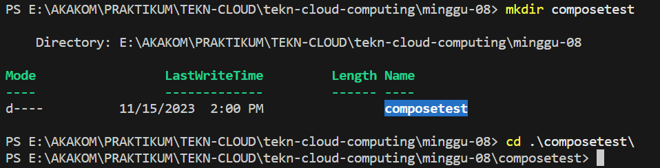

>**2. Di dalam folder `composetest` tadi, tambahkan file `app.py` dan masukkan kode ini:**
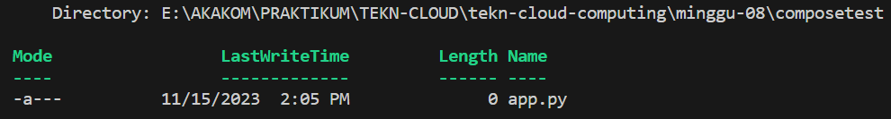
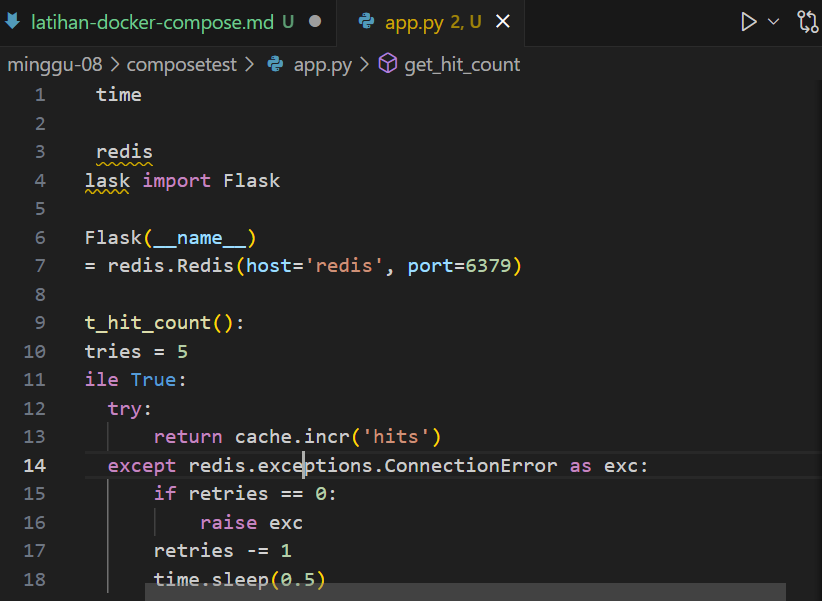

>**3. Buat file dengan nama `requirements.txt` di dalam folder `composetes` dan masukkan perintah berikut:**
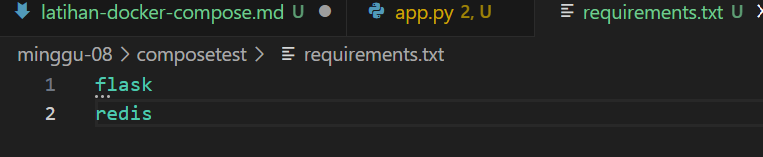

>**4. Buat `Dockerfile` untuk membangun docker image, dan tambahkan perintah berikut:**
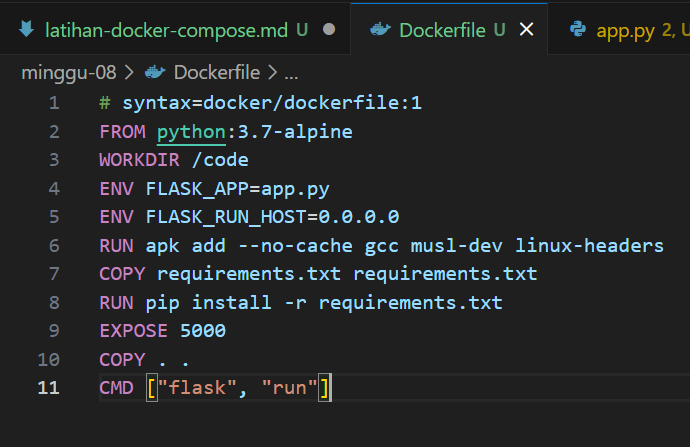

>**5. Buat file dengan nama `compose.yaml` pada folder yang tadi sudah dibuat, kemudian masukkan perintah berikut:**
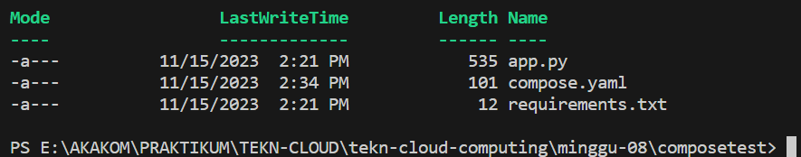
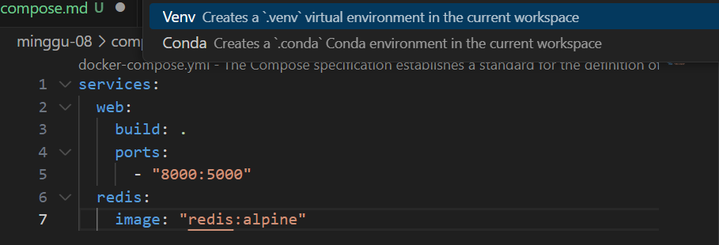

>**6. Mulai coba dan jalankan applikasi dengan Docker Compose**
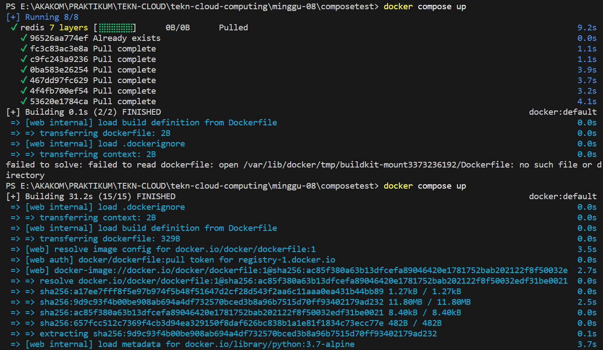
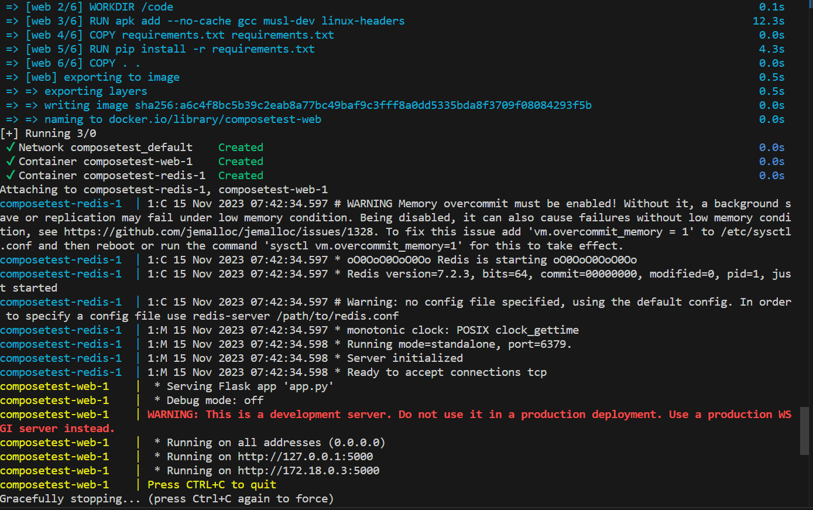

>**7. Coba ketikkan alamat `http://localhost:8000/` pada browser dan perhatikan applikasi yang sudah berjalan**

>**8. Apabila di refresh lagi maka akan berubah jumlah angkanya**
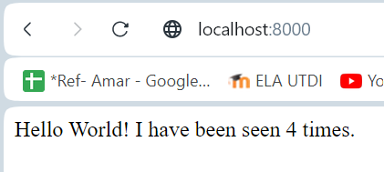

>**9. Jika dicek dengan perintah `docker image ls` maka list repository yang muncul seperti tadi yang sudah dibuat**
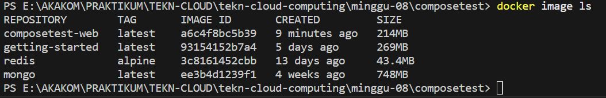

>**10. Coba dilakukan edit pada file `compose.yaml` untuk menambahkan bind mount**
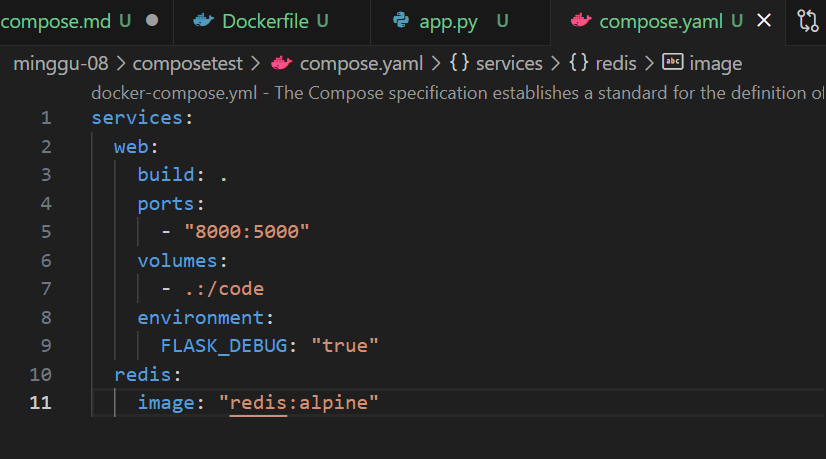

>**11. Kemudian coba jalankan lagi dengan perintah `docker compose up`**
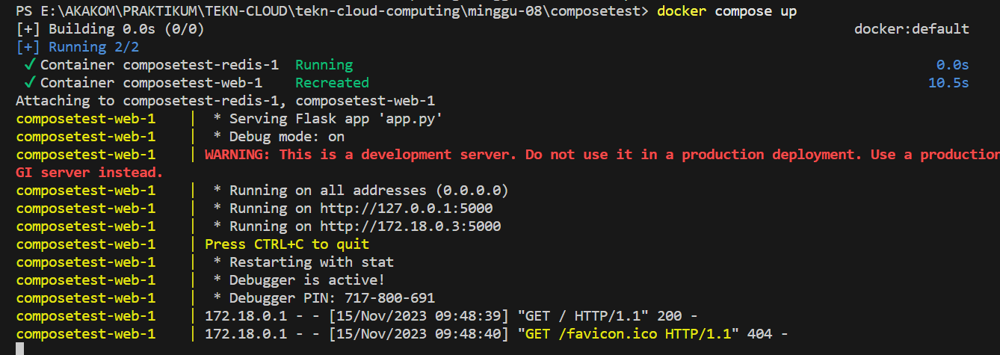

>**12. Check pada browser dengan link `http://localhost:8000`**
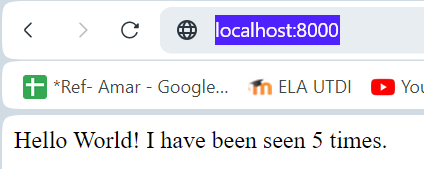

>**13. Mengupdate aplikasi untuk memastikan bahwa perubahan pada output kode tidak mempengaruhi penambahan jumlah waktu**
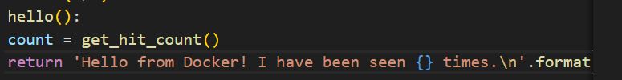
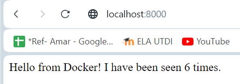

>**14. Mencoba jalankan dengan perintah lain**
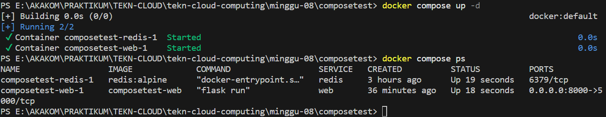

>**15. Menghentikan aplikasi yang berjalan pada docker compose**
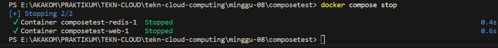