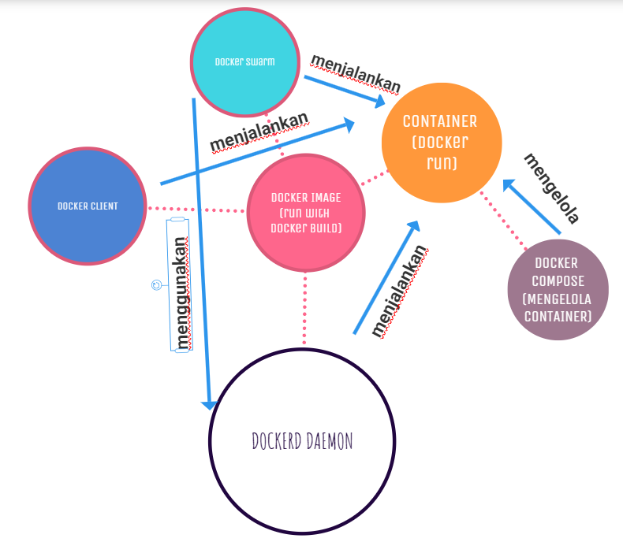

# Penjelasan :

>**1. `Docker image` adalah file yang berisi semua kode dan dependensi yang diperlukan untuk menjalankan sebuah aplikasi. `Docker image` dapat dibuat dengan menggunakan perintah `docker build`.**

>**2. `Container` adalah instance dari `Docker image` yang berjalan di mesin fisik atau virtual. Container dapat dibuat dengan menggunakan perintah `docker run`.**

>**3. `Dockerd` adalah daemon yang menjalankan Docker. `Dockerd` bertanggung jawab untuk menjalankan container, mengelola ruang disk, dan menyediakan API yang digunakan oleh docker client.**

>**4. `Docker client` adalah aplikasi yang digunakan untuk berinteraksi dengan Docker. `Docker client` dapat digunakan untuk membuat, menjalankan, dan mengelola `container`.**

>**5. `Docker compose` adalah alat yang digunakan untuk mendefinisikan dan mengelola kumpulan `container`. `Docker compose` memungkinkan Anda untuk mendefinisikan kumpulan `container` dalam satu file, yang dapat memudahkan untuk mengelola kumpulan `container`.**

>**6. `Docker Swarm` adalah fitur Docker yang memungkinkan untuk menjalankan kumpulan `container` secara terdistribusi. `Docker Swarm` menggunakan `dockerd` untuk menjalankan `container` secara terdistribusi.**

# Diagramnya kira kira-seperti ini
