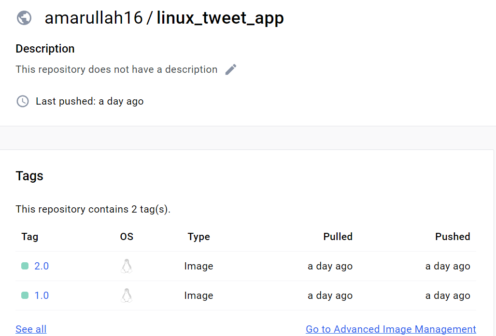

# TASK 1
>**1. Clone sample docker berupa `linux tweet app` dari github**

>**2. Jalankan single task pada container Alpine di Linux**

>**3. Jalankan interactive Ubuntu Container dan lihat deskripsinya**

>**4. Untuk melihat hasil container alpine yang sudah dicoba tadi**

>**5. Jalankan MYSQL Container, pada kasus ini nama db adalah `mydb`**

>**6. Tampilkan container yang sedang berjalan**

>**7. Cek apa yang terjadi pada container dengan menggunakan command ini**

>**8. Melihat MYSQL version**

>**9. Menghubungkan ke proses shell yang baru di dalam container yang sedang berjalan**

# TASK 2
>**1. Buat image dari website sederhana, dengan membuat direktori `linux_tweet_app` dan membuat file bernama `Dockerfile`**

>**2. Buat docker image dengan menggunakan instruksi yang ada pada dockerfile**

>**3. Memulai container baru dari docker image yang sudah dibuat**

>**4. Hasil yang diperoleh adalah tampilan website yang berhasil diakses**

>**5. Ketika sudah berhasil dijalankan, maka hapus kembali yang tadinya sudah dibuat**

# TASK 3
>**1. Memulai web app dan menampilkan direktori ke kontainer**

>**2. Buka alamat browser dan lihat hasilnya**

>**3. Modifikasi pada website yang tengah berjalan, dengan command berikut:**

>**4. Kembali ke website dan refresh websitenya**

>**5. Hentikan dan hapus container yang tadi sudah dijalankan**

>**6. Buat image baru dan tandai sebagai `2.0`**

>**7.Lihat list yang sudah dibuat**

>**8. Ujicoba container baru dari image yang baru saja dibuat dan lihat hasilnya**

>**9. Jalankan container lainnya, pada kasus ini menggunakan versi lama yang berasal dari docker image yang sebelumnya. Kemudian cek hasilnya**

>**10. Push docker image ke DockerHub, sebelumnya lihat dulu listingnya**

>**11. Login dulu ke DockerHub**

>**12. Push Versi `1.0` dan `2.0`**

>**13. Untuk mengetahui hasilnya, buka `https://hub.docker.com/r/amarullah16`, dalam kasus ini menggunakan akun pribadi**

