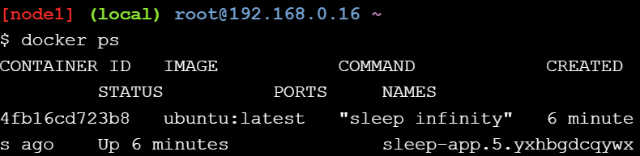

# Docker Orchestration Hands-On Lab

## Section 1 : Configure Swarm Mode
>**1.Jalankan perintah `docker run -dt ubuntu sleep infinity` pada node1 atau terminal1**

>**2. Buat node Manager, jalankan perintah `docker swarm init pada node1`**

>**3. Gabungkan worker node2 dan node3 ke Swarm pada node1**

**Hasilnya seperti gambar di bawah ini**

## Section 2 : Menyebarkan aplikasi di beberapa host
>**1.Menerapkan komponen aplikasi sebagai layanan Docker**

**verifikasi apakah `service create` sudah diterima oleh Swarm Manager**

## Section 3 : Meluaskan cakupan aplikasi
>**1.Tingkatkan jumlah kontainer dalam layanan sleep-app menjadi 7 dengan perintah `docker service update --replicas 7 sleep-app`.**

**Periksa hasil perintah**

>**2. Ubah layanan kembali menjadi hanya 4 container dengan perintah `docker service update --replicas 4 sleep-app`**

## Section 4 : bersihkan node and jadwalkan ulang container
>**1. Pada node1**

>**2. Pada node2**

>**3. Pada langkah ini, kita akan mencoba mengeluarkan node2 dari service. Jalankan perintah `docker node update --availability drain node2` pada terminal node1**

**Hasilnya seperti berikut**

>**4. Pindah ke terminal node2, jalankan perintah `docker ps` untuk melihat hasil dari node2 yang sudah dikeluarkan dari layanan tadi**

>**5. Terakhir, periksa kembali layanan pada node1 untuk memastikan bahwa kontainer telah dijadwalkan ulang**

## Cleaning Up
>**1. Jalankan perintah docker service rm sleep-app pada node1 untuk menghapus layanan bernama myservice**

>**2. Bisa juga menggunakan perintah docker kill <CONTAINER ID> pada node1 untuk mematikan kontainer yang telah kita mulai di awal**

>**3. Terakhir, mari kita hapus node1, node2, dan node3 dari Swarm. Kita dapat menggunakan perintah `docker swarm leave --force` untuk melakukannya**
**Pada node1**

**Pada node2 dan node3**

