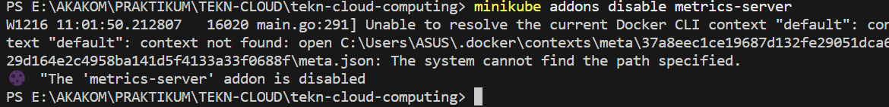

# HELLO MINIKUBE

>**1. Membuat cluster minikube**

>**2. Buka dashboard**

## BUAT DEPLOYMENT
>**1. Gunakan perintah `kubectl create` untuk membuat Deployment yang mengelola sebuah Pod. Pod menjalankan container berdasarkan image Docker yang disediakan**

>**2. Lihat hasil deployment**

>**3. Lihat pod**

>**4. Melihat event cluster**

>**5. Melihat konfigurasi pada `kubectl`**

>**6. Melihat log aplikasi untuk container dalam pod**

## Buat sebuah service
>**1. Mengekspos Pod ke internet publik menggunakan perintah kubectl expose**

>**2. Melihat service yang telah dibuat sebelumnya**

>**3. Jalankan perintah `minikube service hello-node`. setelah itu buka browser yang akan menyajikan aplikasi dan menunjukkan respons aplikasi**

## MENGAKTIFKAN ADD-ONS
>**1. Lihat daftar add-on yang saat ini didukung**

>**2. Aktifkan add-on, sebagai contoh kita akan mengaktifkan addons `metrics-server`**

>**3. Melihat Pod dan Layanan yang dibuat dengan menginstal add-ons tersebut**

>**4. Menonaktifkan `metrics-server`**

## Cleaning Up
>**1. Sekarang kita dapat membersihkan sumber daya yang tadi sudah dibuat di dalam cluster**

>**2. Menghentikan Minikube cluster**

>**3. Jika memang tidak dibutuhkan, bisa juga dengan menghapus Minikube VM**

